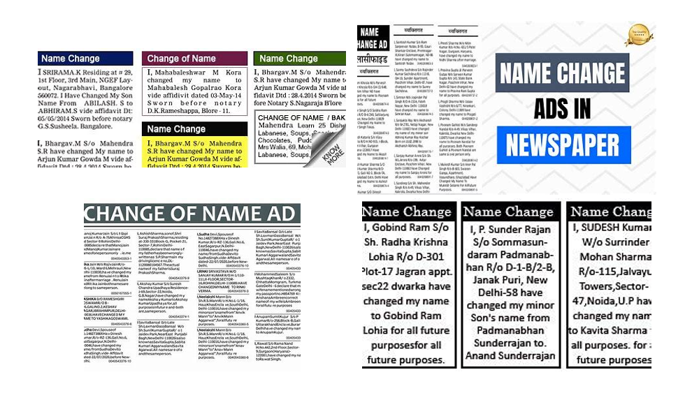
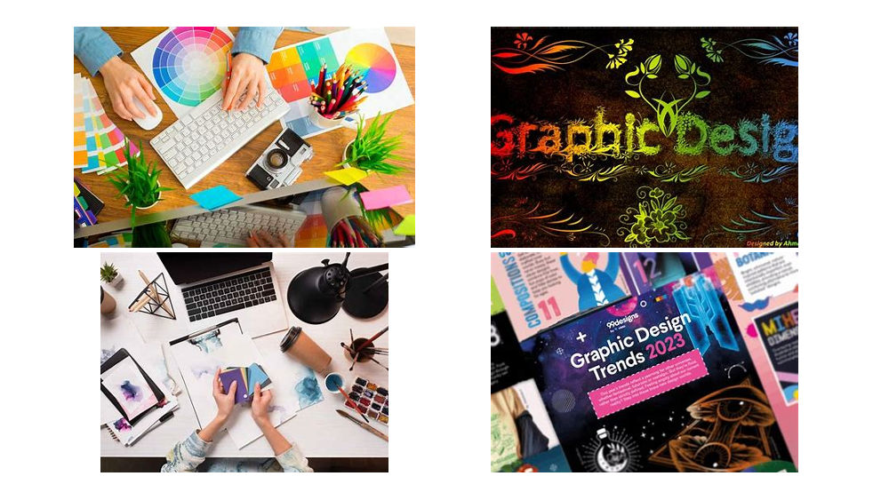

<!DOCTYPE html>
<html lang="en">

<head>
  <meta charset="UTF-8">
  <meta name="viewport" content="width=device-width, initial-scale=1.0">
  <title>HM Solutions Ltd</title>
  
</head>

<body>
  <!-- Header -->
  <header>
    

      
      HM Solutions Ltd
    

    <nav>
      <ul>
        <li><a href="#">About</a></li>
        <li>
          <a href="#">Services</a>
          <ul>
            <li><a href="#">IT Consulting</a></li>
            <li><a href="#">System Integration</a></li>
          </ul>
        </li>
        <li>
          <a href="#">Products</a>
          <ul>
            <li><a href="#">Hardware Solutions</a></li>
            <li><a href="#">Software Tools</a></li>
          </ul>
        </li>
        <li><a href="#">Articles</a></li>
      </ul>
    </nav>
  </header>

  <!-- Slideshow -->
  

    

      
      
We sell all kinds of London Used Computers. -  Laptops, All-In-One Computer, Chromebook etc.   To get one or more, <a href="https://wa.me/+2348053579779">Click</a>

    

    

      
      
To Register and get your premium NIN Card, <a href="https://wa.me/+2348053579779">Click</a>

    

    

      
      
We are involved in all levels of FCT Schools online Application for Admission. Primary, Junior or Seniour Secondary.  To Apply for any Level of FCT Schools, <a href="https://wa.me/+2348053579779">Click</a>

    

    

      
      
We also do Newspaper Publication for Change of Name and the likes of it.   To get your <b>New Name</b> published, <a href="https://wa.me/+2348053579779">Click</a>

    

    

      
      
We do all kinds of eAffidavits. i.e. Statutory Declaration of Age, Marriage Certificate, Change of Name, Reconciliation of Name,  Correction of Name, Loss of Particulars etc.  To get you an Affidavit, <a href="https://wa.me/+2348053579779">Click</a>

    

    

      
      
We are also involved in all kinds of Graphic Designs. i.e. ID Card, Wedding Invitation, Jotter, Calender, Photo-Album etc.  To get the best Design, <a href="https://wa.me/+2348053579779">Click</a>

    

    

      
      
<h3></h3><a href="https://wa.me/+2348053579779">Click me</a>

    

      <!-- Add your other slides here -->
      
      <!-- Navigation Buttons -->
      <a class="prev" onclick="changeSlide(-1)">&#10094;</a>
      <a class="next" onclick="changeSlide(1)">&#10095;</a>
    

    
  

  <!-- Footer -->
  <footer>
    

      

          <h3>Contact Us</h3>
          
Email: info@legendspikers.com

          
Phone: +234 123 456 7890

          
Address: Kubwa, Abuja

      

      

          <h3>Quick Links</h3>
          <ul>
              <li><a href="teams.html">Our Teams</a></li>
              <li><a href="schedule.html">Match Schedule</a></li>
              <li><a href="gallery.html">Photo Gallery</a></li>
          </ul>
      

      

          <h3>Follow Us</h3>
          

              <a href="https://web.facebook.com/HMTelecoms" target="_blank" title="Facebook">
                  <i class="fab fa-facebook"></i> Facebook
              </a>
              <a href="https://x.com/HMusa3" target="_blank" title="Twitter">
                  <i class="fab fa-twitter"></i> Twitter
              </a>
              <a href="https://www.instagram.com/hmtelecoms0/" target="_blank" title="Instagram">
                  <i class="fab fa-instagram"></i> Instagram
              <a href="https://www.linkedin.com/in/hussaini-musa-68614283/" target="_blank" title="LinkedIn">
                  <i class="fab fa-instagram"></i> LinkedIn
              <a href="https://wa.me/+2348053579779" target="_blank" title="WhatsApp">
                  <i class="fab fa-instagram"></i> WhatsApp
              </a>
          

      

  

  

      
&copy; 2024 HM Solutions Limited. All rights reserved.

  <!-- JavaScript -->
  
</body>

</html>
